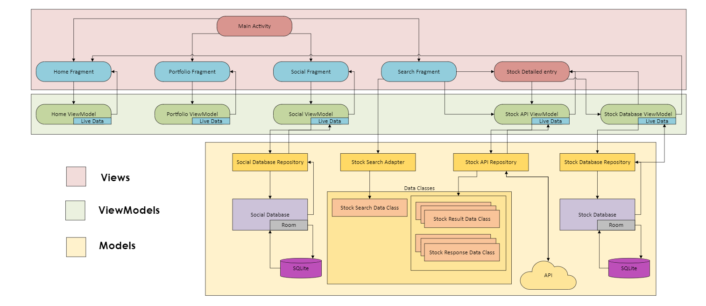
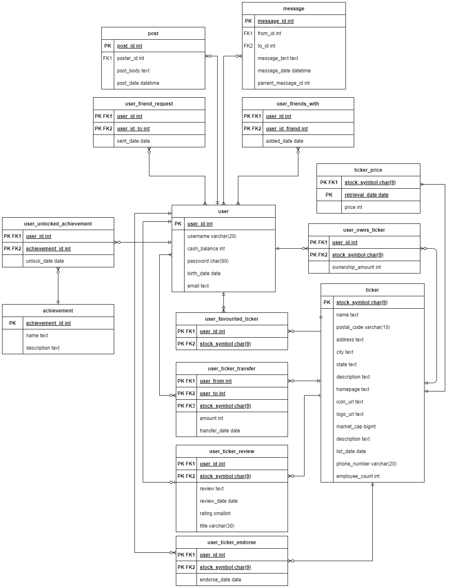
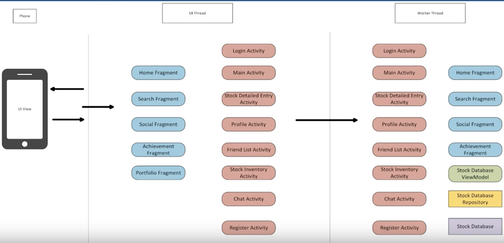

# CMPT362-StockSim
## Short Description
The app is built as a group project for CMPT 362-Android Development. The intent is to build an app for people to practice trading stocks,
the profit and the total value money will be updated after the notification of changed from the `Polygon API`. You can search thoundsands of companies in USA which is on the stock market,
with the start of 10k USD on hand, the app also integrate achievements based on the live event, such as Buying first 5 stocks, first 10 stocks, profit over 1000 USD, and so on.
Additionally, the app also contain social media for user to create a simple post (like a simple Tweet), people can view other user achievements, what stock do they own, also can add friend and send chat message.
## System Design
* **MVVM Diagram:**

* **Database Schema:**

* **Thread Diagram:**

**(*) All the information about user is encrypted and saved in MariaDB, and we also communicate with Polygon API and save stocks detail through MariaDB.**

## Live Demo
https://github.com/user-attachments/assets/51a3768c-c168-468d-abe6-caefd214be2b
* **Please checkout our website for more detail demo with explanation for each iteration!**

## Contributors:
1. Arda Cifci
2. Tran Quang Ngoc Cao
3. Jayden Brown
4. Karmanya Khanna
